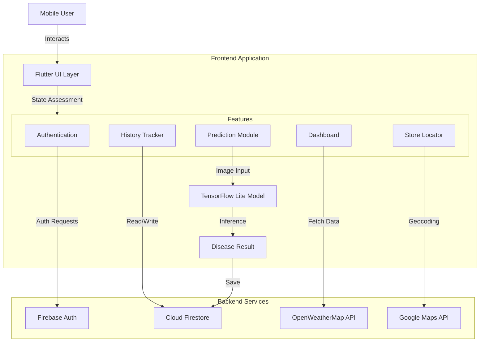

# AgriGuard Plus

> **Smart Agriculture Companion for Global Farmers**

[](https://flutter.dev/)
[](https://firebase.google.com/)
[](https://www.tensorflow.org/lite)
[](LICENSE)

AgriGuard Plus is an intelligent mobile application designed to empower farmers with cutting-edge technology. By leveraging Machine Learning and Cloud services, it provides instant crop disease detection, localized weather updates, and agricultural resources.

---

## System Architecture

The application follows a clean, modular architecture separating the UI, Business Logic, and Data layers.



---

## Key Features

### AI-Powered Analysis
- **Instant Detection**: Identify diseases like Bacterial Blight, Brown Spot, and Blast Disease.
- **Offline Capable**: Uses on-device TensorFlow Lite for rapid inference.
- **Recommendations**: Get immediate treatment advice and preventive measures.

### Smart Dashboard
- **Real-Time Weather**: Localized temperature and conditions via OpenWeatherMap.
- **Quick Scans**: One-tap access to camera or gallery for crop analysis.
- **Daily Tips**: Curated agricultural tips for better yield.

### Location Services
- **Nearby Stores**: Locate agricultural supply stores sorted by distance.
- **Interactive Maps**: Integrated Google Maps for easy navigation.

### Secure & Personalized
- **User Profiles**: Secure login and profile management via Firebase.
- **History Tracking**: Cloud-synced history of all your past analyses.

---

## Tech Stack

- **UI Framework**: Flutter (Dart)
- **State Management**: Stateful Widgets & Provider
- **Authentication**: Firebase Auth (Email/Password)
- **Database**: Cloud Firestore
- **Machine Learning**: TensorFlow Lite
- **External APIs**: 
  - OpenWeatherMap (Weather)
  - Google Maps (Location)

---

## Getting Started

### Prerequisites
- Flutter SDK (3.7+)
- Android Studio / VS Code
- Valid API Keys for Firebase, Google Maps, and OpenWeatherMap

### Installation

1. **Clone the Repository**
   ```bash
   git clone https://github.com/Aditya19110/agri_gurad.git
   cd agri_gurad
   ```

2. **Install Dependencies**
   ```bash
   flutter pub get
   ```

3. **Environment Setup**
   Create a `.env` file in the root directory:
   ```env
   OPENWEATHER_API_KEY=your_openweather_api_key_here
   ```

4. **Run the App**
   ```bash
   flutter run
   ```

---

## Project Structure

```
lib/
├── config/          # Themes and Constants
├── screens/         # UI Pages (Login, Home, Prediction)
├── services/        # Logic (Auth, Weather, History)
├── widgets/         # Reusable Components
├── main.dart        # Entry Point
└── routes.dart      # Navigation Map
```

---

## Contributors

| **Aditya Kulkarni** | **Vedika Lohiya** |
| :---: | :---: |
| [](https://github.com/Aditya19110) | [](https://github.com/vedikalohiya) |

---

<div align="center">
  <p>Made with ❤️ to support Sustainable Agriculture</p>
</div>
